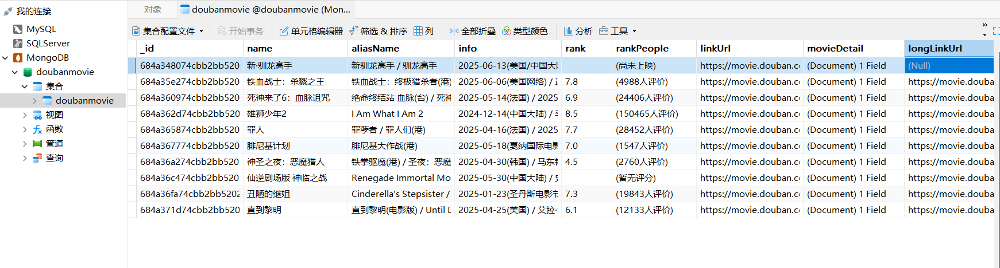

# 第三章 反爬机制与应对

## 4.1 常见反爬虫机制

- User-Agent 检查
- IP 限制（封禁/滑块/验证码）
- 频繁访问等

## 4.2 User-Agent 中间件

```python name=doubanproject/doubanproject/UserAgentMiddleware.py
from fake_useragent import UserAgent

class UserAgentMiddleware(object):
    def __init__(self, crawler):
        super().__init__()
        self.ua = UserAgent()
        self.ua_type = crawler.settings.get("RANDOM_UA_TYPE", "random")

    @classmethod
    def from_crawler(cls, crawler):
        return cls(crawler)

    def process_request(self, request, spider):
        def get_user_agent():
            return getattr(self.ua, self.ua_type)
        request.headers.setdefault('User-Agent', get_user_agent())
```

settings.py 配置启用：

```python name=doubanproject/doubanproject/settings.py
DOWNLOADER_MIDDLEWARES = {
    'doubanproject.UserAgentMiddleware.UserAgentMiddleware': 543,
    'scrapy.downloadermiddlewares.httpproxy.HttpProxyMiddleware': 110,
}
DOWNLOAD_DELAY = 30
USER_AGENT = "Mozilla/5.0 (Macintosh; Intel Mac OS X 10_15_6) AppleWebKit/537.36 (KHTML, like Gecko) Chrome/85.0.4183.83 Safari/537.36"
ROBOTSTXT_OBEY = False
```

## 4.3 MongoDB 数据表预览

爬取到的电影数据存储在 MongoDB 数据库如下图所示：



如上图，每部电影包括名称、别名、评分、简介等字段。你可以用 MongoDB 可视化工具（如 Robo 3T、Compass）查看和分析数据。

---

## 4.4 代理池与限速

- 支持 scrapy-proxies 插件，配置代理池，降低被封概率
- DOWNLOAD_DELAY 配置访问间隔

## 4.5 实战建议

- 遇到验证码/滑块要手动处理或换IP
- 合理设置延迟、切换UA和代理
- 遵守 robots.txt，合理采集

---

> 以上为豆瓣影评 Scrapy 爬虫项目从环境到实战的全流程文档。遇到具体代码报错或反爬难点可继续补充新章节。